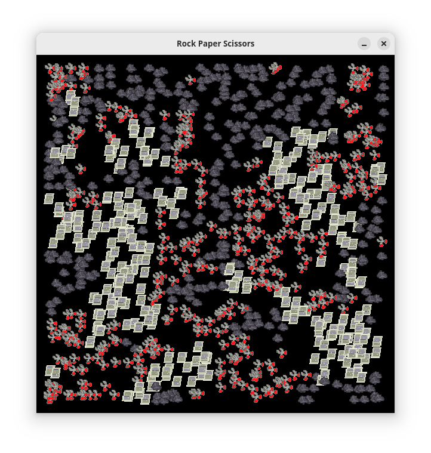

# Rock Paper Scissors Simulator
Rock paper scissors sim written in C language.



## Command line args:
- -w; Define width of the window
- -h; Define height of the window
- -c; Set number of entities to spawn
- -f; Set maximum framerate

Example:
```
rps-sim -w900 -h900 -c10000 -f60
```

## Dependencies:
- SDL2
